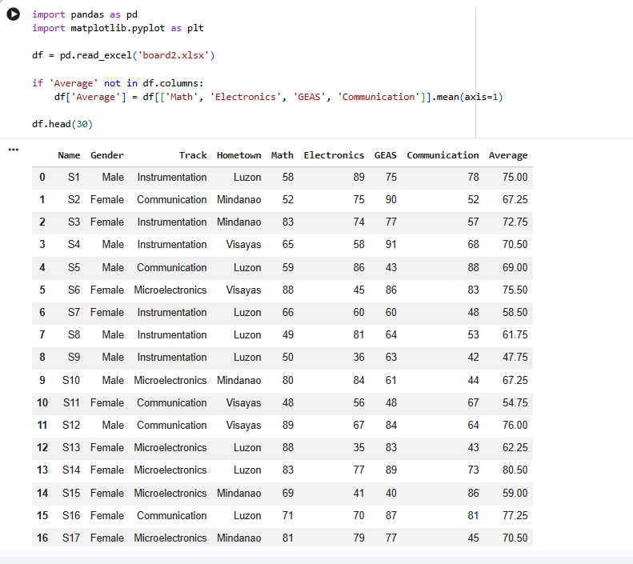
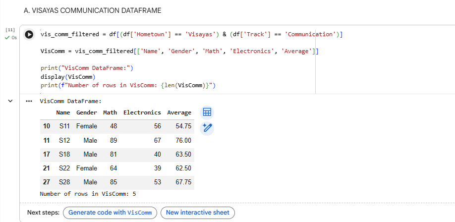
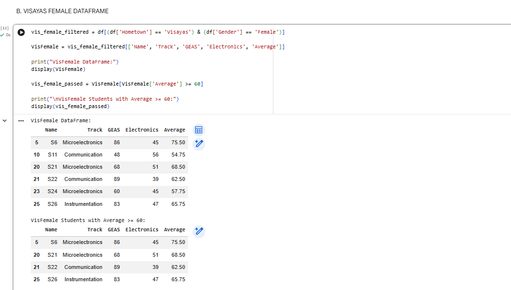
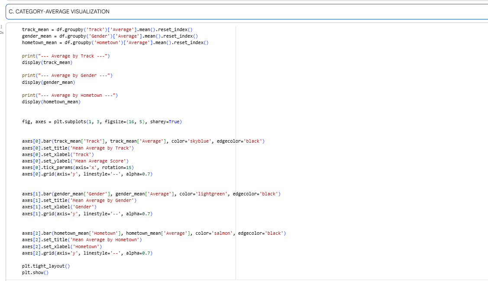
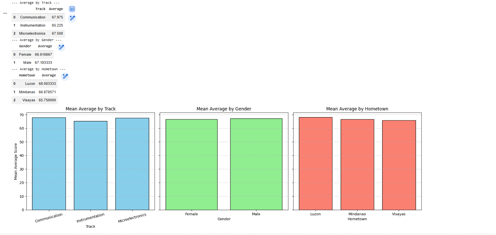

# Experiment 4: Data Wrangling and Data Visualization


> **Name:** Padama, Joseph Neil C.  
> **Section:** 2ECE-C  
> **Date Submitted:** September 17, 2026

---

## Objectives
1. Filter tabular data using several categorical and numerical conditions.
2. Construct focused DataFrames by selecting relevant features.
3. Summarize the relationship between categorical features and a numerical variable.
4. Communicate a data comparison using clear and correctly labeled plots.

## Setup

The initial code imports pandas and matplotlib.pyplot, reads board2.xlsx into a DataFrame named df, and computes the Average score across Math, GEAS, Electronics, and Communication before previewing the first 30 rows.

<details>
<summary><b>Click to Expand: Initial Setup Code and Output</b></summary>

```python
import pandas as pd
import matplotlib.pyplot as plt

df = pd.read_excel('board2.xlsx')

if 'Average' not in df.columns:
    df['Average'] = df[['Math', 'GEAS', 'Electronics', 'Communication']].mean(axis=1)

df.head(30)
```

</details>

The excel file was loaded using pd.read_excel(). To calculate the total performance score, the row-wise mean was computed using df[['Math', 'GEAS', 'Electronics', 'Communication']].mean(axis=1) with axis=1 to cover all four board subjects. df.head(30) was then used to verify that the dataset and new Average column loaded accurately.

## A. VISAYAS COMMUNICATION DATAFRAME
Create a DataFrame named VisComm containing students whose Hometown is Visayas and whose Track is Communication. Retain only the columns: Name, Gender, Math, Electronics, and Average. Display the resulting DataFrame and its total row count.

<details>
<summary><b>Click to Expand: Item A Code and Output </b></summary>

```python
vis_comm_filter = (df['Hometown'] == 'Visayas') & (df['Track'] == 'Communication')
VisComm = df.loc[vis_comm_filter, ['Name', 'Gender', 'Math', 'Electronics', 'Average']]

print("VisComm DataFrame:")
display(VisComm)
print(f"Number of rows in VisComm: {len(VisComm)}")
``` 



</details> 


A Boolean mask was made, combining two conditions with the & operator: df['Hometown'] == 'Visayas' and df['Track'] == 'Communication'. Passing this condition into .loc[] allowed to filter the matching rows and select only the required columns (Name, Gender, Math, Electronics, Average). len(VisComm) was then utilized to print the final row count.

## B. VISAYAS FEMALE DATAFRAME

Create a second DataFrame named VisFemale containing students whose Hometown is Visayas and whose Gender is Female. Retain only the columns: Name, Track, GEAS, Electronics, and Average. Display VisFemale, then display a second filtered view showing only those with an Average >= 60 without modifying VisFemale.

<details>
<summary><b>Click to Expand: Item B Code and Output </b></summary>

```python
vis_female_filter = (df['Hometown'] == 'Visayas') & (df['Gender'] == 'Female')
VisFemale = df.loc[vis_female_filter, ['Name', 'Track', 'GEAS', 'Electronics', 'Average']]

print("VisFemale DataFrame:")
display(VisFemale)

vis_female_passed = VisFemale[VisFemale['Average'] >= 60]
print("\nVisFemale Students with Average >= 60:")
display(vis_female_passed)
``` 



</details>


VisFemale was created by filtering for female students from Visayas and extracting the requested columns using .loc[]. To display students with scores of 60 or higher without modifying VisFemale, a temporary DataFrame `vis_female_passed = VisFemale[VisFemale['Average'] >= 60]` was created and displayed it directly below the primary DataFrame.


## C. CATEGORY-AVERAGE VISUALIZATION

Examine how the recorded Average score differs across Track, Gender, and Hometown. Compute category means, display the summary tables, and construct a 3-bar chart subplot layout to compare averages visually.

<details>
<summary><b>Click to Expand: Item C Code and Output </b></summary>

```python
track_mean = df.groupby('Track')['Average'].mean().reset_index()
gender_mean = df.groupby('Gender')['Average'].mean().reset_index()
hometown_mean = df.groupby('Hometown')['Average'].mean().reset_index()

plt.style.use('seaborn-v0_8-whitegrid')
fig, axes = plt.subplots(1, 3, figsize=(16, 5), sharey=True)

bars0 = axes[0].bar(track_mean['Track'], track_mean['Average'], color='#3498db', edgecolor='black')
axes[0].set_title('Mean Average by Track', fontweight='bold')
axes[0].set_xlabel('Track')
axes[0].set_ylabel('Mean Average Score')
axes[0].bar_label(bars0, fmt='%.1f', padding=3)

bars1 = axes[1].bar(gender_mean['Gender'], gender_mean['Average'], color='#e74c3c', edgecolor='black')
axes[1].set_title('Mean Average by Gender', fontweight='bold')
axes[1].set_xlabel('Gender')
axes[1].bar_label(bars1, fmt='%.1f', padding=3)

bars2 = axes[2].bar(hometown_mean['Hometown'], hometown_mean['Average'], color='#2ecc71', edgecolor='black')
axes[2].set_title('Mean Average by Hometown', fontweight='bold')
axes[2].set_xlabel('Hometown')
axes[2].bar_label(bars2, fmt='%.1f', padding=3)

plt.tight_layout()
plt.show()
``` 





</details> 


The dataset was aggregated using .groupby() on Track, Gender, and Hometown combined with .mean() to evaluate category-level performance. To plot the charts side-by-side, the student used plt.subplots(1, 3, sharey=True). Setting sharey=True ensures all subplots share the exact same y-axis scale for direct comparison across groups. Finally, bar_label() was applied to render numerical values above each bar.

**Category Interpretation Statements**
> 1. **Track:** Communication track students recorded the highest overall mean score (68.0).
> 2. **Gender:** Male students scored slightly higher on average (67.2) than female students (66.6).
> 3. **Hometown:** Students originating from Luzon achieved the highest average score (68.1) compared to Mindanao and Visayas.


